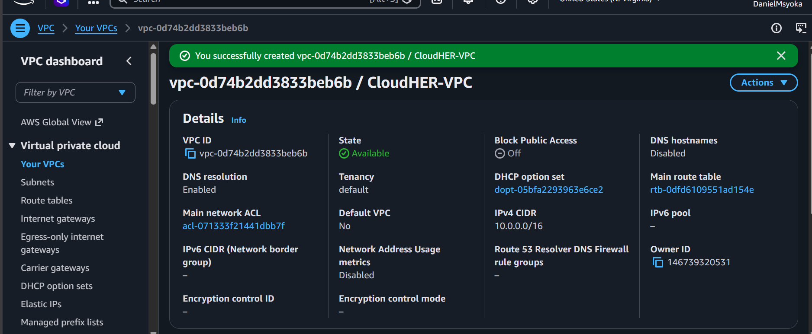
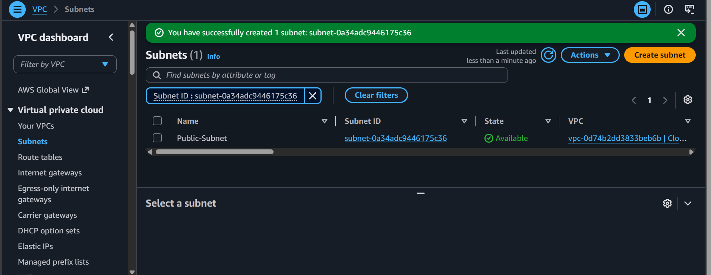
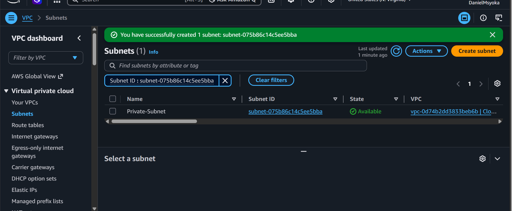
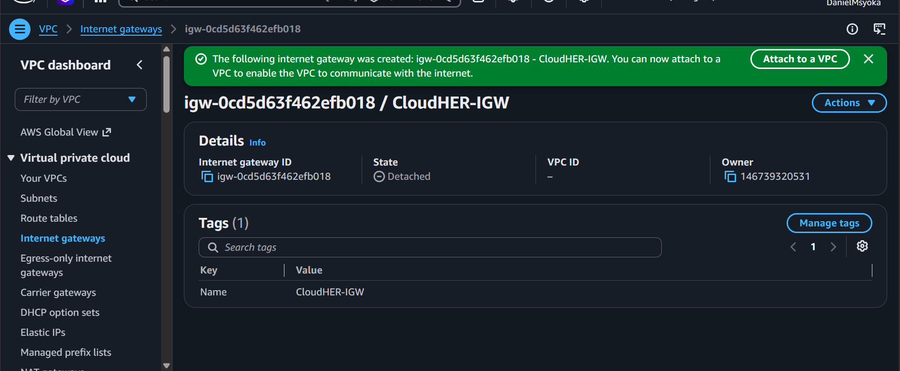
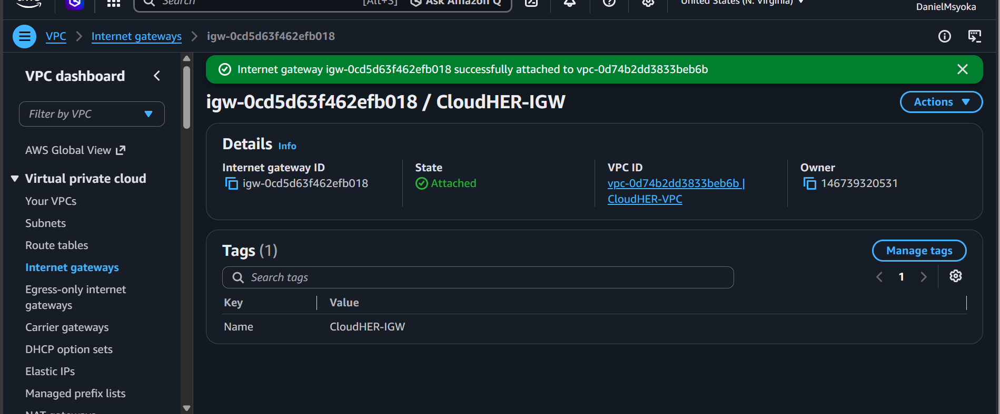
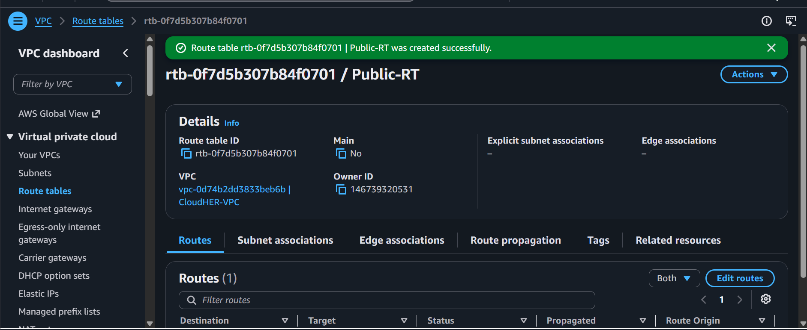
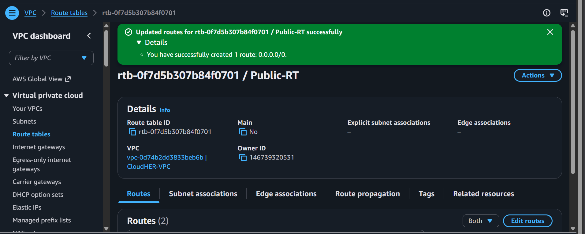
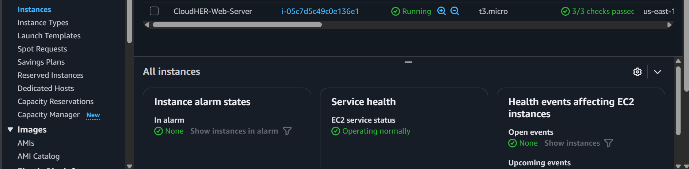
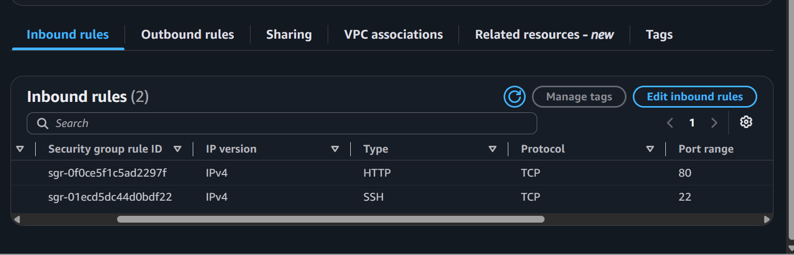
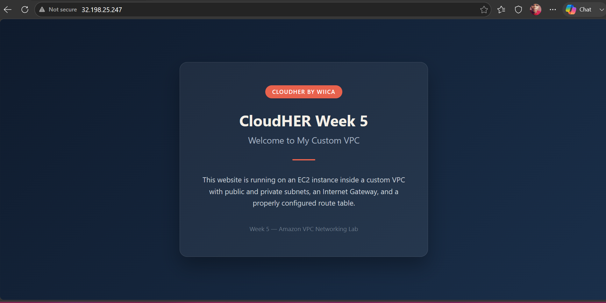

# AWS VPC Networking Lab — Public & Private Subnets

<p align="center">
  <strong>CloudHER by WIICA — Week 5 Project</strong><br>
  <em>Amazon VPC + EC2 Hands-on Lab</em>
</p>

<p align="center">
  
  
  
</p>

---

## Table of Contents

- [Overview](#overview)
- [Architecture](#architecture)
- [Prerequisites](#prerequisites)
- [Project Structure](#project-structure)
- [Step-by-Step Guide](#step-by-step-guide)
- [Troubleshooting Notes](#troubleshooting-notes)
- [Deliverables Checklist](#deliverables-checklist)
- [Skills Demonstrated](#skills-demonstrated)
- [What I Learned](#what-i-learned)
- [Cleanup](#cleanup)
- [Author](#author)
- [Acknowledgements](#acknowledgements)
- [License](#license)

---

## Overview

This project provisions a **custom Amazon VPC** — not the AWS default network — split into a public subnet and a private subnet, wires the public subnet up to the internet with an Internet Gateway and route table, and launches an **EC2 instance running Apache** inside the public subnet to serve a custom webpage.

It was a practical, hands-on introduction to:
- Designing a VPC's IP address space with CIDR notation
- Separating public-facing resources from private, internet-isolated resources
- Understanding exactly what makes a subnet "public" (it's not automatic)
- Securing an instance with scoped security group rules
- Deploying and verifying a web server end-to-end

The goal was to *build* the public/private separation that underpins most real AWS architectures, rather than just read about it — and to understand precisely which component would break the site if it were missing.

---

## Architecture

```
                              Internet
                                 │
                    Internet Gateway (CloudHER-IGW)
                                 │
┌────────────────────────────────────────────────────────────┐
│                  CloudHER-VPC (10.0.0.0/16)                 │
│                                                              │
│   ┌─────────────────────────┐   ┌─────────────────────────┐ │
│   │   Public-Subnet          │   │   Private-Subnet        │ │
│   │   10.0.1.0/24            │   │   10.0.2.0/24           │ │
│   │                          │   │                          │ │
│   │   ┌──────────────────┐   │   │   (no resources /       │ │
│   │   │ EC2 + Apache      │   │   │    no internet route)  │ │
│   │   │ CloudHER-Web-Server│   │   │                          │ │
│   │   └──────────────────┘   │   │                          │ │
│   │                          │   │                          │ │
│   │  Route Table: Public-RT  │   │  No route table          │ │
│   │  0.0.0.0/0 → IGW         │   │  association with IGW    │ │
│   └─────────────────────────┘   └─────────────────────────┘ │
└────────────────────────────────────────────────────────────┘
```

> **Note:** A subnet is only "public" because a route table associated with it sends `0.0.0.0/0` traffic to the Internet Gateway. `Private-Subnet` above was deliberately never associated with that route table — that single missing association is the entire reason it stays isolated. See [Troubleshooting Notes](#troubleshooting-notes) for a connectivity issue this same principle caused during setup.

---

## Prerequisites

- An AWS account (Free Tier eligible)
- Basic familiarity with the AWS Management Console
- A modern web browser
- *(Optional)* Local terminal with an SSH client

---

## Project Structure

```text
CloudHER-Week5-VPC-Lab/
│
├── index.html
├── README.md
├── LICENSE
├── .gitignore
└── Screenshots/
    ├── 01-vpc.png
    ├── 02-subnets_public.png
    ├── 02-subnets_private.png
    ├── 03-igw.png
    ├── 04-route-table.png
    ├── 05-rt-association.png
    ├── 06-ec2.png
    ├── 07-security-group.png
    └── 08-website.png
```

---

## Step-by-Step Guide

Follow these steps in order to replicate this deployment. Each step's screenshot sits right below it, so the evidence lines up with the activity that produced it.

### Step 1: Create the VPC

1. Open the **VPC Console → Your VPCs → Create VPC**.
2. Resources to create: **VPC only**.
3. Name tag: `CloudHER-VPC`.
4. IPv4 CIDR block: `10.0.0.0/16`.
5. Leave everything else default → **Create VPC**.

**What this does:** `/16` reserves roughly 65,000 private IP addresses for the entire network — far more than needed here, but it's the standard sizing convention that leaves room to grow.


*`CloudHER-VPC` created with CIDR `10.0.0.0/16`*

---

### Step 2: Create the Subnets

**Public-Subnet**
1. Subnets → Create subnet → VPC: `CloudHER-VPC`.
2. Name: `Public-Subnet`, CIDR: `10.0.1.0/24`.
3. After creation: Actions → Edit subnet settings → enable **Auto-assign public IPv4 address** → Save.

**Private-Subnet**
1. Name: `Private-Subnet`, CIDR: `10.0.2.0/24`.
2. Leave auto-assign public IP **disabled**.

**What this does:** Splitting `10.0.0.0/16` into two `/24` blocks carves out 256 addresses per subnet — one range for internet-facing resources, one for resources that should never be directly reachable.


*`Public-Subnet` (`10.0.1.0/24`) with auto-assign public IPv4 enabled*


*`Private-Subnet` (`10.0.2.0/24`) with auto-assign public IP left disabled*

---

### Step 3: Create and Attach an Internet Gateway

1. Internet Gateways → Create internet gateway → Name: `CloudHER-IGW`.
2. Select it → Actions → **Attach to VPC** → `CloudHER-VPC`.

**What this does:** An Internet Gateway is the VPC's only doorway to the public internet. On its own it grants no subnet internet access — it just makes the door available for a route table to point at.



*`CloudHER-IGW` in state **Attached** to `CloudHER-VPC`*

---

### Step 4: Build the Public Route Table

1. Route Tables → Create route table → Name: `Public-RT`, VPC: `CloudHER-VPC`.
2. Select `Public-RT` → **Routes** tab → Edit routes → Add route:
   - Destination: `0.0.0.0/0`
   - Target: Internet Gateway → `CloudHER-IGW`
3. **Subnet associations** tab → Edit subnet associations → check `Public-Subnet` only → Save.

> ⚠️ Do **not** associate `Private-Subnet` with this route table — that omission is what keeps it private.

**What this does:** `0.0.0.0/0 → IGW` tells AWS "any traffic not addressed to somewhere inside this VPC should exit through the Internet Gateway." Associating it only with `Public-Subnet` scopes that rule to just that one subnet.


*`Public-RT` showing `0.0.0.0/0 → CloudHER-IGW`*


*`Public-RT` associated only with `Public-Subnet`*

---

### Step 5: Launch the EC2 Instance

1. EC2 → Launch instance → Name: `CloudHER-Web-Server`.
2. Choose **Amazon Linux 2023** as the AMI.
3. Select the **t3.micro** instance type (Free Tier eligible).
4. Create a new key pair and download the `.pem` file — store it securely, it can't be downloaded again.
5. Network settings → Edit:
   - VPC: `CloudHER-VPC`, Subnet: `Public-Subnet`
   - Auto-assign public IP: **Enable**
6. Configure the security group (`CloudHER-Web-SG`) with these inbound rules:

   | Type | Protocol | Port Range | Source |
   |------|----------|------------|--------|
   | SSH  | TCP      | 22         | My IP |
   | HTTP | TCP      | 80         | `0.0.0.0/0` (Anywhere-IPv4) |

7. Click **Launch instance** and wait for the state to show **Running**.

Result: `i-05c7d5c49c0e136e1`, `us-east-1a`, public IP `32.198.25.247`, all status checks passed.

> **Tip:** If using EC2 Instance Connect, see [Troubleshooting Notes](#troubleshooting-notes) for why "My IP" can block it.


*EC2 console: instance **Running**, status checks passed*


*Inbound rules: SSH (My IP) and HTTP (Anywhere)*

---

### Step 6: Connect to the Instance

1. In the EC2 console, select the running instance.
2. Click **Connect → EC2 Instance Connect** tab → **Connect**.

You should see a terminal prompt like:

```
[ec2-user@ip-10-0-1-xxx ~]$
```

---

### Step 7: Install Apache HTTP Server

```bash
sudo dnf install httpd -y
```

**What this does:**
- `dnf` — the package manager for Amazon Linux 2023
- `install httpd` — installs the Apache HTTP Server package
- `-y` — automatically confirms the installation

---

### Step 8: Enable and Start Apache

```bash
sudo systemctl enable httpd
sudo systemctl start httpd
```

**What this does:**
- `enable` — configures Apache to start automatically on every boot
- `start` — starts the service immediately

---

### Step 9: Verify Apache Is Running

```bash
sudo systemctl status httpd
```

Look for **`active (running)`** in the output — that confirms Apache is up and serving requests.

---

### Step 10: Deploy the Website Content

Apache serves files from `/var/www/html/`.

```bash
sudo nano /var/www/html/index.html
```

Paste in this repo's `index.html` content, then save (`Ctrl+O`, `Enter`, `Ctrl+X`).

---

### Step 11: Test Locally, Then Publicly

```bash
curl localhost
```

This should print the page's HTML directly in the terminal — confirming Apache is serving correctly from the instance itself.

Then, from a browser:

```
http://32.198.25.247
```

(Use `http://`, not `https://`.) The custom page should load — confirming every layer, from VPC down to Apache, is correctly wired together.


*Custom page loading successfully at the instance's public IP*

---

## Troubleshooting Notes

Real issues encountered while building this, and how they were resolved:

### 1. EC2 Instance Connect Failed with "Error Establishing SSH Connection"

**Cause:** EC2 Instance Connect routes traffic through AWS-owned IP ranges, not the user's actual IP address. A security group restricted to "My IP" blocks that traffic.

**Fix:** Temporarily changed the SSH inbound rule source to `0.0.0.0/0` (Anywhere-IPv4), connected, then reverted the rule back to "My IP" afterward.

**Production recommendation:**
- Restrict SSH to the official [AWS Instance Connect IP ranges](https://docs.aws.amazon.com/AWSEC2/latest/UserGuide/ec2-instance-connect-set-up.html) for your region, **or**
- Prefer **AWS Systems Manager Session Manager**, which needs no open SSH port at all.

### 2. Diagnostic Order for "Website Won't Load"

Worked outward from the server, one layer at a time:

| Layer | Check | Result |
|-------|-------|--------|
| Server | `curl localhost` on the instance | Returned the page |
| Server | `systemctl status httpd` | `active (running)` |
| Network | Security Group allows HTTP 80 from Anywhere | Correct |
| Network | Route table (`0.0.0.0/0` → IGW) associated with Public-Subnet | Correct |
| Network | Instance has a Public IPv4 address | Correct |
| Client | Browser using `http://`, not `https://` | Confirmed |

**Key lesson:** isolate methodically — **Server → Network → Client** — rather than guessing at random settings.

---

## Deliverables Checklist

- [x] Custom VPC created (`CloudHER-VPC` / `10.0.0.0/16`)
- [x] Public Subnet + Private Subnet
- [x] Internet Gateway attached
- [x] Public Route Table with correct route and association
- [x] EC2 running in Public Subnet
- [x] Apache installed and website reachable from the internet
- [x] Screenshots saved in `Screenshots/`

---

## Skills Demonstrated

- **Amazon VPC** — custom network design with CIDR planning
- **Subnetting** — public vs. private subnet separation
- **AWS Networking Fundamentals:**
  - Internet Gateway
  - Route tables and subnet associations
  - Security Groups
- **AWS EC2** — instance provisioning (Free Tier)
- **Linux Administration** — Amazon Linux 2023 (`dnf`, `systemctl`)
- **Web Server Management** — Apache HTTP Server installation and configuration
- **Systematic Cloud Troubleshooting** — Server → Network → Client isolation
- **Secure Remote Access** — patterns and trade-offs between "My IP," Instance Connect, and endpoints

---

## What I Learned

Through this project I learned how to:
- Design a VPC's address space and split it into meaningful subnets
- Understand that a subnet is only "public" because of its route table association — not by default
- Attach and use an Internet Gateway correctly
- Scope security group rules tightly instead of leaving ports open by default
- Diagnose connectivity issues by isolating server, network, and client layers
- Recognize why EC2 Instance Connect needs different security group handling than direct SSH from a home IP

---

## Cleanup

To avoid unexpected AWS charges once the lab is fully reviewed:

1. Terminate the EC2 instance(s)
2. Detach and delete the Internet Gateway
3. Delete the subnets
4. Delete the route table(s)
5. Delete the VPC
6. Delete unused security groups and key pairs

---

## Homework

See [HOMEWORK.md](homework.md) for the multi-subnet design challenge, bonus tasks, and reflection answers.

## Author

**Daniel Nzioki Musyoka**

[](https://github.com/Daniel059)
[](https://www.linkedin.com/in/daniel-nzioki-musyoka)

---

## Acknowledgements

This project was completed as part of the **CloudHER by WIICA Week 5 Cloud Computing Assignment**, designed to introduce learners to AWS networking fundamentals through hands-on deployment.

I would like to extend my sincere gratitude to my mentor, **Rajpreet Gill**, for her invaluable guidance and support throughout my CloudHER journey. Her mentorship deepened my understanding of AWS networking and provided practical insight into building secure, well-structured cloud architectures.

| Organization | Link |
|--------------|------|
| Women Innovating in Cloud Africa (WIICA) | [LinkedIn](https://www.linkedin.com/company/wiica/) |
| Paula Ali Wakabi (Miss. Cloud) (Founder@WIICA) | [LinkedIn](https://www.linkedin.com/in/paulawakabi/) |
| Rajpreet Gill (Mentor) | [LinkedIn](https://www.linkedin.com/in/rajpreet-gill-devop/) |

---

## License

This project is intended for educational and portfolio purposes.

---

> **💡 Tip for future me:** A subnet isn't "public" because you say so — it's public because a route table you control sends it to the Internet Gateway. Trace that one line first whenever something isn't reachable.